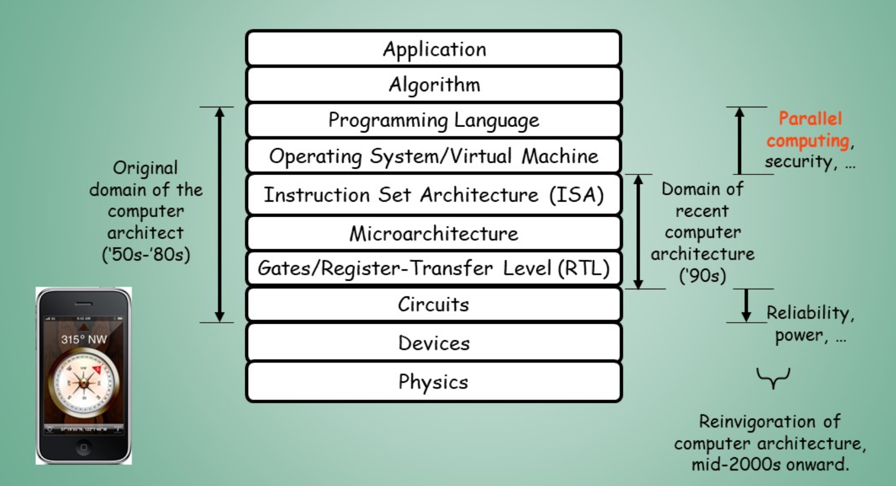
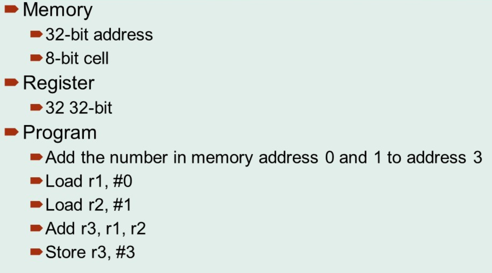

# introduction

## Computer Architecture
EE: Micro electronics
CS: Microprocessor and system software

## 考试
平时30% 
考试70% 闭卷

## 课程结构
1. 第一部分 Review(undergraduate)
   1. ISA 指令集体系结构
   2. 基本流水线和概念
2. 第二部分 并行结构
   1. 指令级并行ILP
   2. 线程级并行TLP
   3. Request-level Parallelism RLP 请求级
   4. 数据级并行
3. 练习

## 基本知识点
1. 计算机的基本概念
   1. 计算机组成和体系结构
   2. 微计算机和单片计算机
2. 编程
   1. 任何语言
   2. 理解汇编
3. 书籍

## introduction
1. Harvard Mark I 哈佛，展示了一般用途计算机的可行性。1944
2. ENIAC 1946 第一台电子通用计算机。
3. 现在计算机的种类：Edge Computing
4. 微处理器：单芯片上的处理器 片上系统，微处理器的性能比大型机和小型机提升的更快，现在几乎所有的计算机都是基于uP
5. 并行:
   1. 应用上的并行
      1. 数据级并行
      2. 任务级并行
   2. 体系结构并行
      1. 指令级并行
      2. GPU
      3. 线程级并行
      4. 请求级并行
6. 并行分类：SISD SIMD MISD MIMD 单指令单数据流
7. 之前的体系结构几乎与ISA等同，组织架构为微架构，其他计算机设计叫实现。微体系结构/微处理器体系结构 Microarchitecture，是在计算机工程中，将一种给定的指令集架构 (instruction set architecture)在处理器中执行的方法
8. 体系结构的最广泛定义：计算机体系结构是抽象层的设计，他允许我们使用可用的制造技术有效地实现信息处理应用程序。从物理到应用的抽象设计。

## computer architecture
1. 真正的计算机体系结构不是仅仅的晶体管，单独的指令或者特殊的实现设计
   1. 目标机器的特定需求
   2. 最大化性能：成本、功耗、可用性
2. 三方面
   1. ISA
   2. 微架构(Organization)
   3. Hardware(implementation)
3. 摩尔定律
晶体管数量每18月翻一番，性能翻倍。
但目前登纳德定律失效，摩尔定律即将失效，必须考虑并行系统和异构系统，大芯片趋势。

## 编程作业



```
    ### 231012Coding Practice
    # 寄存器为32位
    # 内存地址为32位，存储单元为8位
    # 模拟执行以下指令：
    # Load r1, #0
    # Load r2, #1
    # Add r3, r1, r2
    # Store r3, #3
    ###

    class Register:#设置寄存器类 
        def __init__(self, size, unit_size, register_address, data):
            self.address = register_address
            self.size = size
            self.unit_size = unit_size
            self.data = data
            self.byte1 = (data >> 24) & 0xFF
            self.byte2 = (data >> 16) & 0xFF
            self.byte3 = (data >> 8) & 0xFF
            self.byte4 = data & 0xFF

        def read(self, address):# 设置寄存器的读数据的方法
            ## 超过地址范围报错
            if address < self.address or address >= self.address+0x04:
                raise ValueError("Memory address out of bounds")
            ## 按存储单元依次读取数据
            integer_value = (self.byte1 << 24) | (self.byte2 << 16) | (self.byte3 << 8) | self.byte4
            self.data = integer_value
            
        def write(self, address, value):# 设置寄存器的写数据的方法
            ## 超过地址范围报错
            if address < self.address or address >= self.address+0x04:
                raise ValueError("Memory address out of bounds")
            ## 按存储单元依次写入数据
            byte1 = (value >> 24) & 0xFF
            byte2 = (value >> 16) & 0xFF
            byte3 = (value >> 8) & 0xFF
            byte4 = value & 0xFF
            self.byte1 = byte1
            self.byte2 = byte2
            self.byte3 = byte3
            self.byte4 = byte4
            integer_value = (self.byte1 << 24) | (self.byte2 << 16) | (self.byte3 << 8) | self.byte4
            self.data = integer_value
        
    # 设置寄存器地址和内存参数
    # 内存地址为32位，存储单元为8位
    register1_address = 0x00
    register2_address = 0x04
    register3_address = 0x08
    register_size = 32
    register_unit_size = 8

    # 生成寄存器r1,r2,r3
    r1 = Register(register_size, register_unit_size, register1_address, 0)
    r2 = Register(register_size, register_unit_size, register2_address, 0)
    r3 = Register(register_size, register_unit_size, register3_address, 0)

    # 模拟ARM指令执行
    # 打印结果
    print("指令未执行前   寄存器结果：r1 =%d, r2 =%d, r3 =%d"%(r1.data,r2.data,r3.data))
    r1.write(0x00, 0)
    print("Load r1, #0    执行结果为：r1 =%d, r2 =%d, r3 =%d"%(r1.data,r2.data,r3.data))
    r2.write(0x04, 1)
    print("Load r2, #1    执行结果为：r1 =%d, r2 =%d, r3 =%d"%(r1.data,r2.data,r3.data))
    r3.write(0x08, r1.data + r2.data)
    print("Add r3, r1, r2 执行结果为：r1 =%d, r2 =%d, r3 =%d"%(r1.data,r2.data,r3.data))
    r3.write(0x08, 3)
    print("Store r3, #3   执行结果为：r1 =%d, r2 =%d, r3 =%d"%(r1.data,r2.data,r3.data))
```

## 引言
1. RISC体系结构的计算机提高了性能门槛，这样的体系结构和组织方式的发展共同促成了计算机性能持续增长17年。
2. 但是持续了几十年的半导体工艺规律难以维系，登纳德缩放比例定律、摩尔定律。迫使半导体行业采用多核多处理器的设计，处理器的性能提升，也从单纯依赖指令级并行ILP 转向数据级并行 DLP 和线程级并行 TLP. 以及后面的请求级并行RLP. 
3. 提高能耗-性能-成本的唯一途径是专用 领域专用体系结构domain-specific architecture.

## 真正的计算机体系结构
1. 计算机实现包括两部分：组成（微体系结构）和硬件
2. 超频
