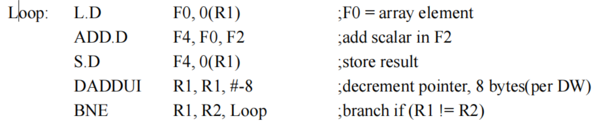

# 1.解释名词
1. **Instruction Level Parallelism** 指令级并行性是指在一个程序的指令序列中，可以同时执行多个指令以提高执行速度。这包括指令重排、流水线执行、超标量和动态执行等技术，旨在使处理器在同一时钟周期内执行多个指令
2. **Simultaneous Multi-Threading** 同时多线程技术是一种在多流出、动态调度处理器上开发指令级并行和线程级并行的改进的多线程技术。同时多线程使用多发射和动态调度处理器同时实现指令级和线程级的并行，通过寄存器重命名和动态调度，来自各个独立线程多条指令可以被同时发射，而不考虑指令间的相关性，相关由动态调度负责处理。在同时多线程中，所有的发射槽在一个时钟周期内被多个线程共享，线程级并行和指令级并行被同时开发。
3. **Branch Target Buffer** 分支目标缓冲器是一种缓存结构，用于存储分支指令的目标地址。它帮助处理器在执行分支指令时更快地确定分支目标，以提高程序的执行性能。在IF段就需要知道这条未译码的指令是否为分支指令，并且如果他是分支指令，要尽快知道NPC值应当为多少
4. **UMA机器** UMA机器是一种计算机体系结构，**其中所有处理器共享相同的内存访问时间。每个处理器都可以等效地访问系统中的所有内存位置，而无需考虑物理位置**。这与NUMA（非统一内存访问）相对，后者在内存访问时间上有区别。
5. **等分带宽** 等分带宽指的是将**系统的带宽均匀分配给不同的组件或任务**。在计算机体系结构中，这通常涉及将系统的数据传输能力（带宽）平均分配给不同的处理单元、内存模块或其他系统组件，以确保它们都能获得相对平等的资源支持。
6. **Hazard (冒险)** 在计算机体系结构中，冒险是指可能导致程序执行出错或者不符合期望的数据或控制相关性。这包括**数据冒险（Data Hazard）数据的依赖关系、控制冒险（Control Hazard）分支冒险和结构冒险（Structural Hazard）硬件资源的竞争**等
7. **Loop Unrolling (循环展开)** 循环展开是一种优化技术，通过减少循环跳转指令和停顿次数，来提高程序性能。这通常涉及将循环体内的多个迭代合并成一个更大的迭代，以减少分支开销和提高指令级并行性。
8. **Exception**：异常。在计算机体系结构中，异常是指程序执行期间可能出现的**错误或不寻常情况**。当程序运行时发生异常，系统会中断正常执行流程，转而执行与异常相关的处理代码。异常用于处理错误状况，提高程序的鲁棒性和可靠性。常见的异常包括除零、内存访问错误等。区别于interrupt中断，硬件按下一个键
9. **Reorder Buffer**:重排序缓冲器是现代处理器中的一种结构，用于处理指令的乱序执行。在流水线处理中Tomasulo算法或者记分牌算法会乱序执行同时结果也会乱序提交，指令的执行可能会发生乱序，但最终的结果必须按照程序顺序提交。重排序缓冲器用于保持并重新排序指令的结果，以确保它们按照正确的顺序提交到寄存器文件或内存。
10. **Data Level Parallelism** (数据级并行性):数据级并行性是指通过**同时处理不同数据元素来提高程序性能**的技术。它涉及到对数据的并行操作，例如SIMD指令集和**向量处理器** **GPU**等。 矢量
11. **栅栏同步** 栅栏同步是一种同步机制，用于**确保在多线程或并发执行的程序中，某些点的指令在其他线程达到相同点之前不会继续执行**。栅栏同步通常用于**协调并发执行的线程**。
12. **网络直径**:网络直径是指网络中任意两个节点之间最短路径的长度，这与网络拓扑有关。在计算机网络中，网络直径是一个衡量网络性能和延迟的重要指标。
13. **forwarding 技术** 在数据相关性的情况下，如果后续的指令需要使用前一条指令的结果，可以通过**转发将结果直接传递给后续指令**，而不必等待结果存储在寄存器或内存中。
14. **Stall** 暂停指令流的执行，通常是由于某些原因导致无法继续执行下一条指令。Stall可能发生在流水线中的某个阶段，阻止了指令流的正常进度。
15. BTB VS BPB 分支预测技术受限于预测精度，以及预测失效后的产生的开销 分支目标缓冲器精度依赖于程序和buffer的大小。
    1. Branch History Table，BHT。最简单的动态分支预测方法。用BHT来记录分支指令最近一次或几次的执行情况（成功还是失败 ），并据此进行预测。
    2. 预测尚未译码的指令是否为分支，如果是分支，则下一个PC是什么，这样能够将分支的代价将为０。分支预测缓存中存储着下一条指令的预取地址，这就是分支目标缓冲BTB。用于预测目标地址。缓存保存了最近执行过的分支指令的 PC 值，以及它们的跳转目标地址。先检查BTB，看看是否有一个匹配的条目
    3. BPB存储了最近使用过的分支指令的历史信息，这些信息用于帮助分支预测器做出更准确的预测。
    4. BPB受限于预测精度以及预测错误之后的开销， BTB预测更高，失效的优化：预取多个分支的指令

# 2. 简答题
1. 大规模机器同步的软件、硬件支持方法
    1. 硬件：硬件排队锁、硬件原语
    2. 软件：**带指数回退的旋转锁**、软件排队锁、组合树
   
2. 什么是多处理机的**相关性（coherency）和一致性**（consistency）？给出解决相关性的监听协议和目录协议的工作原理。
如果对某个数据项的任何读操作均可得到其最新写入的值，则认为这个存储系统是一致的，定义包括两个方面：
    1. 相关性(coherency)，即返回给读操作的是什么值；
    2. 一致性(consistency)，即什么时候才能将已写入的值返回给读操作。**相关性和一致性是互补的**
    3. 目录协议（Directory Protocol）：
        概念： 目录协议维护一个集中的目录，记录了系统中每个缓存块的状态以及哪些处理器拥有或者请求了该缓存块。
        工作原理： 当一个处理器要读取或写入一个缓存块时，它会先向目录发送请求。**目录会维护一个状态信息**，表示缓存块的状态，例如是否被某个处理器修改或者是否是干净的。根据这些信息，目录会决定是否允许请求的操作，或者是否需要通知其他处理器。
        更新： 当一个处理器修改了一个缓存块时，目录会更新自己的状态，并通知其他持有或者请求该缓存块的处理器，使它们的缓存失效或者更新。
        监听协议（Snooping Protocol）：
    4. 监听协议
        概念： 监听协议**通过监视（"snooping"）系统中的总线**，实时检测对共享数据的访问，而不是通过中心目录。当一个处理器在总线上执行读或写操作时，其他处理器的缓存会监听这个总线，并根据监听到的信息做出相应的处理。
        工作原理： 当一个处理器在总线上执行写操作时，监听协议会通知其他处理器，使它们的缓存失效或者更新。如果是读操作，监听协议可以在其他缓存中查找所需的数据，避免了在主存中进行不必要的读取。

3. 写直达cache与写回cache区别：

写直达法：如果数据已经在cache中，则先更新cache再写回内存；如果cache当中没有的话，则直接写回内存，每次操作都会写回内存。
写回法：当发生写操作的时候，会检查数据是否在cache中，如果在的话将当前的数据写入cache中更新，并标记为脏；如果不在cache中；如果不在的话，就需要检查block中数据有没有标记为脏数据，如果是的话就需要写回内存；如果不是则直接写入即可。最后都需要标记为脏，表明数据与内存中的数据不一致。
写回法不用频繁地访问内存来更新，减少时间的开销，但是cache中的数据会和内存中不一致。

4. 流水线的三类冒险分别是：
（1）结构冒险：当硬件在指令重叠执行中不能支持指令所有可能的组合时发生资源冒险。
（2）数据冒险：在同时执行的指令中，一条指令依赖于前一条指令的数据而得不到时发生的冒险。
（3）控制冒险：流水线中的转移指令或其他改写 PC 的指令造成的冒险。
其中有 3 类数据冒险：RAW（写后读）：指令 j 试图在指令 i 写一个数据之前读取它，这时 j 会读到错误的值，RAW 对应于数据的真相关；WAW（写后写）：指令 j 试图在指令 i写一个数据之前写该数据，留下的值将会是指令 i 的结果，WAW 对应于输出相关，只在特定类型的流水线中才发生；WAR（读后写）：指令 j 试图在指令 i 读一个数据之前写该数据，这时指令 i 会错误的读出新值，WAR 对应于反相关，不会发生在静态流水线之中。解决数据冒险的方法有：双跳（double bump）；停顿（stall）；转发（forwarding）；指令重排序（instruction reorder）。

5. 分支延时槽的原理：引入分支延迟槽的目的主要是为了提高流水线的效率。流水线中，分支指令执行时因为确定下一条指令的目标地址一般要到第 ID 级以后，在目标确定前流水线的取指级是不能工作的，即整个流水线就“浪费”（阻塞）了一个时间片，为了利用这个时间片，**在体系结构的层面上规定跳转指令后面的一个时间片为分支延迟槽**（branch delay slot）。位于分支延迟槽中的指令总是被执行，与分支发生与否没有关系。这样就有效利用了一个时间片，消除了流水线的一个“气泡”.
6. 硬件投机机制的原理和ROB的作用，指出ROB和普通tomasulo算法的保留站reservation stations的功能区别
基于硬件的投机技术实质上是综合了下述三种技术的一种集成技术：①应用动态转移预测技术选择投机指令②应用投机技术达到在控制相关性消除以前就执行指令③应用动态调度技术来调度程序基本块的不同组合。**实际上就是动态投机与动态调度相结合的一种技术。**
（2）ROB 的作用：
重排序缓存（ROB）相当于一个额外的虚拟存储器，相当于 tomasulo 算法中的保留站、load buffer 和 store buffer 等的功能。重构序缓存在指令完成操作之后直到交付这段时间里保存该指令的结果，作为其他指令操作数的源。同时保持算法顺序提交。
（3）ROB 与 RS 的区别：
在 tomasulo 算法中，当指令完成写结果的操作后，所有的后继指令都将从寄存器文件中读取结果。而在推测技术中，只有在指令提交之后寄存器文件才会被更新，即在指令执行到指令提交这段时间之内，由 ROB 提供操作数。
7. tomasulo算法和记分牌算法的异同：
（1）核心思想相同之处：
两者消除 RAW 竞争的思想相同。停顿
Tomasulo 方法采用了记分牌方法的动态调度的核心思想，多条指令处于发射状态，等待条件成熟，可以不按顺序执行。
（2）核心思想不同之处：
Tomasulo 方法通过寄存器重命名过程可以消除 WAR 和 WAW 竞争。记分牌方法能检测 WAR 和 WAW 竞争，一旦检测到存在 WAR 和 WAW 竞争，通过插
入**停顿周期**stall来解决这一竞争。所以，记分牌方法不能消除 WAR 和 WAW 竞争。
（3）检测竞争和控制指令执行方式的不同：
Tomasulo 方法检测竞争和控制指令执行两方面功能是通过分布在每一功能单元的保留站来进行的，因此 Tomasulo 方法是一种**分布式方法**。
记分牌方法的上述功能是通过统一的记分牌来实现的，因此记分牌方法是一种集中式方法。
（4）写结果的方法不同：
Tomasulo 方法直接将功能单元输出的结果送往需要该结果的所有保留站，而不必经过
寄存器这一中间环节。
记分牌方法是将结果写入寄存器, 因而可能造成等待这一结果的指令都出现停顿现象，之后，所有相关指令的功能单元在读 FP 寄存器时又可能出现竞争现象

8. 并行性的含义
**并行性是指计算机系统具有可以同时进行运算或操作的特性，在同一时间完成两种或两种以上工作**。它包括同时性与并发性两种含义。同时性指两个或两个以上事件在同一时刻发生。并发性指两个或两个以上事件在同一时间间隔发生。是通过对有限物理资源强制行驶多用户共享以提高效率。

# 3. 计算题
1. Amdahl原理：改进一个部件所获得的系统性能提高，受限于该部件的执行时间相对于总执行时间的比例。
2. 加速比 = 1/((加速比例)/加速率+(1-加速比例))
3. 新的执行时间 = 源执行时间(1)/加速比

1/(40%/2 + 60%)
1/(99%/2 + 1%) = s
1/(20%/s + 80%)

# 三、在下面的循环中，找到所有真实的依赖关系、输出依赖关系和反依赖。 利用重命名消除输出依赖和反依赖。
1. 真实依赖：S1定义了一个值，随后S2使用了这个值。 s1和s2、s1和s4
2. 反依赖 anti: S1使用了一个值，而随后S2定义了这个值。s1和s2、s2和s3、s3和s4
3. 输出依赖：两个语句都定义了一个值。s1和s3
4. 输入依赖：输入依赖（input dependence）：两个语句都使用了一个值。s1和s2、s2和s3、s1和s4、s2和s4

# 5. simple two-issue, statically-scheduled superscalar MIPS pipeline, using the pipeline latencies from the table. 双发射

双发射其中一个指令可以是load\store\branch\integer alu operation, the other canbe any floating point operation.
（1）每个循环多少个周期 载入、add.d 11、sd和DADDUI 22、BNE 3 故每个循环三个周期
（2）循环展开五份并 展开和调度的代码。
fld 
fld
fld
fld
fld
faddi.d
faddi.d
faddi.d
faddi.d
faddi.d
fsd
fsd
fsd
fsd
fsd
addi x,x,-32
bne
（3）计算性能改进因子
（4）显示此循环的软件流水版本，该版本增加停止的元素一个数组，其起始地址在 R1 中，由 F2 的内容组成。 您必须包括启动和清理代码。

# 二、双核处理器，有两个任务需要并行，其中一个任务需要80%的资源，另外一个任务需要20%的资源。假定并行的部分的加速是2
1. 假定第一个应用40%可以并行，隔离运行这个应用可以加速多少？1/(0.4*1/2)+0.6
2. 假定第二个应用99%可以并行，隔离运行这个应用可以加速多少？1/(0.99*1/2)+0.01 = x
3. 假定第二个应用99%可以并行，并行化它整个系统的加速多少？
1/(0.2/x + 0.8)

总的来说就是总加速比 = 1/(1-改进比例)+改进比例/加速比 
新执行时间等于原执行时间除以总加速比。 

# 三、考虑下面的c代码
for（i=0;i<=100;i++）
A{I}=B{I}+C
(A.B, c和i的地址分别为1000,3000,5000和2000)

Loop:   fld     f0, 0(x1)
        fadd.d  f4,f0,f2
        fsd     f4,0(x1)
        addi    x1,x1,-8
        bne     x1,x2,Loop
2. 每次循环迭代需要大约10条指令（包括加载、相加、存储等指令
3. 整个程序的代码大小也取决于编译器和优化级别，但是大致上可以估计为几百字节。
   
# 三、计算题
1. （1）概述Amdahal定律
   Amdahal 定律定义了使用某一特定功能所获得的加速比。加速比取决于下面两个因素：原计算机计算时间中可升级部分所占的比例；通过升级执行模式得到的改进，也就是说在为整个程序使用这一执行模式时，任务的运行速度会提高多少倍
   （2）计算

# 五、code multiples two vectors that contain single precision complex values:
for(i=0;i<300;i++)
{
    c_re[i] = a_re[i] * b_re[i] - a_im[i] * b_im[i];
    c_im[i] = a_re[i] * b_im[i] + a_im[i] * b_re[i];

}
假设处理器运行在700mhz，最大向量长度为64 load/store有15个周期的启动开销;8个循环的乘单元，5个循环的加/减单元。
1)这个kernel的arithmetic intensity(即算术操作的百分比)是多少?四个乘法和两个加减法
2)假设链接和单个内存管道，需要多少个时钟?包括启动开销在内，每个复杂结果值需要多少时钟周期?
3)如果串联向量序列，每个comptex结果值需要多少时钟周期，包括覆盖珠?
4)现在假设处理器有三个内存管道和链接，如果在循环访问中没有bank冲突，每个结果需要多少时钟周期?

# 六、采用松弛relaxed一致性模型的机器提高性能的原理是什么？实现上主要的分类和其硬件支持措施
松弛一致性允许读写操作的乱序执行，但需要同步操作保证排序原则，使得一个同步程序的表现和顺序模型一致。在保证程序正确的前提下，增加指令执行的并行性并减少时延。所以采用松弛一致性模型的机器可以提高性能。
根据消除读写顺序的内容可以划分为四类：
1）完全存储排序（TSO）：消除了W->R，在硬件支持上为写缓冲的读写旁路等。维护写的次序，这种模型采用写缓存，并提供读的旁路机制，从而允许处理机在写的操作数被所有的别的处理机看到之前就继续进行读。
2）部分存储排序（PSO）:消除了W->W，在硬件支持上为写的流水线或其他并行等。允许非冲突写隐含地乱序进行。实现上，可以使写流水化或重叠，而不是强制一个操作必须在另一个操作之前结束，对同步操作仍需将写操作挂起，因为它引起写保护。
3）弱排序模型（WO）：进一步消除了R->R,R->W，在硬件支持为不封锁读。
4）释放一致性模型：进一步消除了W->SA，R->SA，SR->R，SR->W，在硬件上支持为不封锁读、旁路、无序写等。这种模型区分同步操作中的访问一个共享变量的获取操作SA和将对象释放允许别的处理机获取访问权的释放操作SR。

lr sc 共享锁变量
Load-Reserved (LR) 指令：

LR用于从内存中读取一个值，并将它标记为"reserved"。
如果在执行LR指令时，其他处理器对相同的内存位置进行了修改，LR指令会失败，标记失效。
Store-Conditional (SC) 指令：

SC用于将一个值写回到内存中，但仅在之前执行过LR指令的地方，内存没有被其他处理器修改的情况下才会成功。
如果在执行SC指令时，其他处理器对相同的内存位置进行了修改，SC指令会失败。
这两个指令通常结合使用，实现一种基本的原子读取和写入的操作，用于同步共享变量的访问，例如实现自旋锁

7. （10 分）考虑一个分支目标缓冲区，其惩罚为 0、2 和 2 个时钟
正确的条件分支预测、错误的预测和缓冲区未命中的周期，
分别。 考虑区分条件和条件的分支目标缓冲区设计
无条件分支，存储条件分支的目标地址和目标
无条件分支指令。
(1) 假设命中率为 90%，准确率为 90%，分支频率为 15%。 快了多少
具有分支目标缓冲区的处理器与具有固定两个周期的处理器
分行处罚？
(2) 当在缓冲区中发现无条件分支时，时钟周期的损失是多少？
(3) 确定无条件分支的分支折叠的改进。 认为
90％的命中率，5％的无条件分支频率，以及两个周期的惩罚
缓冲区未命中。 此增强带来了多少改进？ 必须多高
命中率是否会因该增强而提供性能增益？