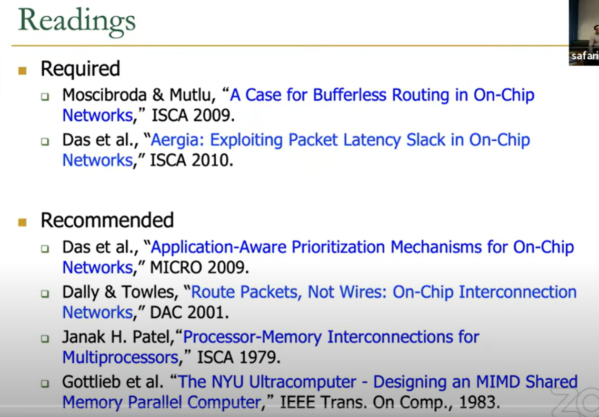
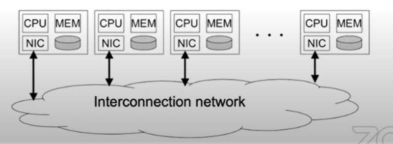

# interconnects

some readings

## 简介
1. Where is interconnect used?

   1. to connect & communicate between components
   2. examples
      1. processors and porcessors
      2. processors and mamories(banks)
      3. processors and caches(banks)
      4. caches and caches
      5. IO devices
2. Interconnects Enable Communication 
3. Why is it important?
   1. Affects the scalability and cost of the system
      1. How large of a system can you build?
      2. How easily can you add more processors?
   2. Affects performance and energy efficiency
      1. How fast can processors, caches, and memory communicate?
      2. How long are the latencies to memory?
      3. How much energy is spent on communication?
   3. Affects reliability and security
      1. can you guarantee messages are delivered or your protocol works?

## interconnects basics
1. topology
   1. specifies the way switches are wired 指定开关的接线方式
   2. affects routing, reliability, throughput, latency, building ease 影响路由、可靠性、吞吐量、延迟、构建简易性
2. routing(algothm)
   1. the way that a message get from source to destination 消息从源到目的地的方式
   2. static or adaptive 静态或者自适应
3. buffering and flow control
   1. what store within the routers & links
      1. entire packets, parts of packets, etc?
   2. how do we throttle during oversubscription 节流
   3. tightly coupled with routing strategy

## Terminology 术语
1. Network interface
   1. Module that connects endpoints(e.g. processors) to network
   2. Decouples computation、communication 解耦计算和通信
2. Link
   1. Bundle of wires that carry a signal
3. Switch/router
   1. Connects fixed number of input channels to fixed number of output channels **将固定数量的输入通道连接到固定数量的输出通道**
4. Channel
   1. A single logical connection between routers/switches 路由器/交换机之间的单个**逻辑**连接
5. Node
   1. a router/switch within a network
6. Message
   1. Unit of transfer for network's clients(processors, memory)
7. packet
   1. unit of transfer for network
8. flit
   1. flow control digit
   2. unit of flow control within network
9. Direct or indirect networks
   1.  endpoints sit inside (direct) or outside (indirect) the work, 内部直接外部间接
   2.  mesh 是直接连接，每个node都是endpoint和switch

## Interconnection Network Topology
1. properties of a topology/Network
   1. Regular or irregular
      1. ring mesh is regular
   2. routing distance
      1. number of links/hops along  a route
   3. diameter 
      1. maximum routing distance within the network
   4. Average distance
      1. Average number of hops across all valid routes
   5. Bisection Bandwidth