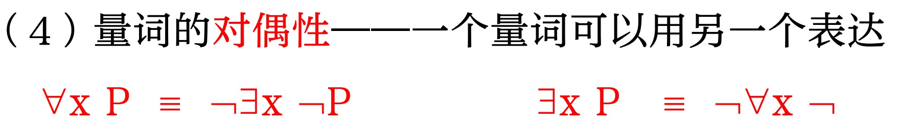

# 一阶逻辑
## 命题逻辑局限性
1. 命题逻辑的推理规则较简单，真值表、为数不多的推理规则
2. 在命题中，命题是最基本的单位，对简单单位不再分解，并**且不考虑命题之间的内在联系和数量关系**
3. 命题只对事物的存在进行限定，而一阶逻辑对于**对象和关系的存在**进行限定

## 2. 一阶逻辑的语义和语法
1. 一阶逻辑
   1. 在命题逻辑的基础上，进一步分析语句中的成分与表达成分之间的关系
2. 三要素
   1. 对象 实体、抽象对象
   2. 关系 相互作用和联系、一元二元
   3. 函数\属性 给定输入，其输出仍是一个对象
3. 实例

4. 一阶逻辑的原子语句
   1. 项 term
      1. 是指代对象的逻辑表达式
   2. 原子语句
      1. 若P是n元谓词符号，t1, ..., tn是项，则P(t1,..., tn)是原子语句
      2. 若项t1, ..., tn都是基础项（非函数项），则P(t1,..., tn)是命题
   3. 复合语句  
      1. 原子语句是复合语句
      2. 复合语句简称公式，也称为语句
5. 全称量词  合取
   1. 一般情况，=>是与全称量词在一起的主要连接词 
   2. 常见错误：把合取与全称量词放在一起
6. 存在量词  析取
   1. 合取 与 存在量词一起使用，自然连接词
   2. 错误：和=>一起使用
7. 量词特性

## 3. 一阶逻辑应用
1. w世界
2. 农夫过河
3. 命题逻辑只是对事物的存在进行限定，而一阶逻辑对于对象和关系的存在进行限定，因而获得更强的表达能力