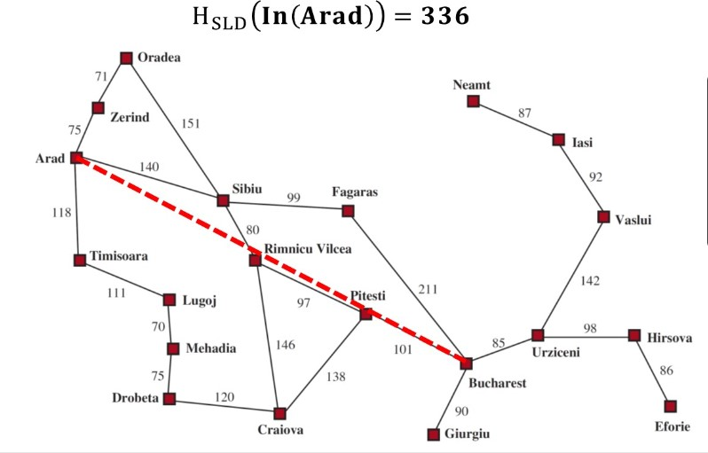
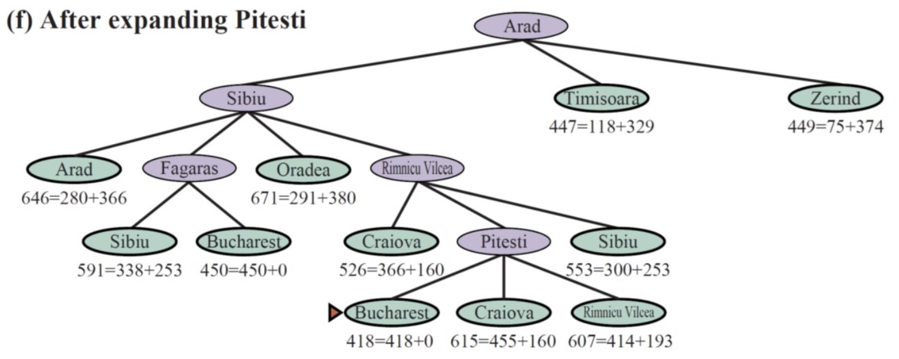
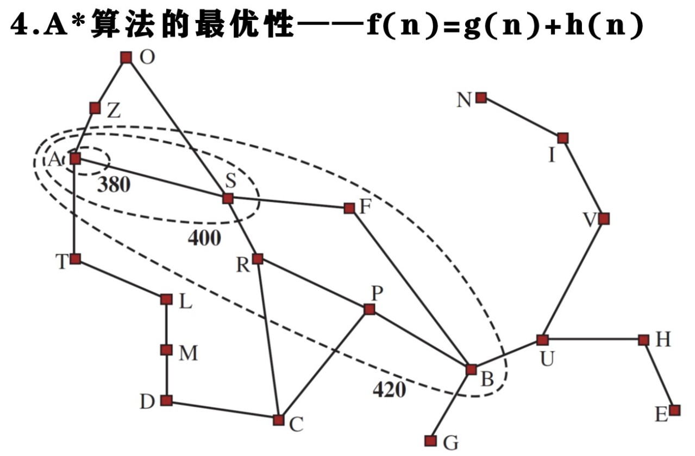
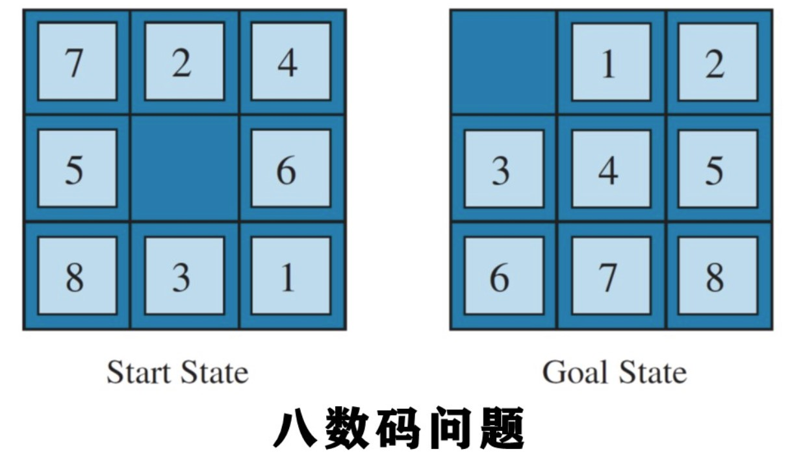

# 问题求解
简单的规则库难以完整描述环境，一部动作难以达到目标——问题求解Agent

## 3.1 问题求解Agent
1. 问题环境描述：
   1. 完全可观察、确定的、已知环境、离散的
   2. 解是一个固定的动作序列
2. 问题求解三个步骤：
   1. 问题、目标形式化——建模过程（抽象，尽可能去除细节）
   2. 搜索空间——得到一个解——动作序列
   3. 执行
3. 搜索问题形式化描述五要素：
   1. Agent初始状态
   2. Agent可能得行动，给定状态s，Actions(s)返回可执行动作集合，可应用
   3. 转移模型（函数），RESULT(s,a), s状态下执行动作a后到达的状态
   4. 目标测试，测试是否为状态目标
   5. 路径耗散、代价
4. 解：从初始状态到目标状态的一组行动序列
   - 解的好坏由路径耗散评价

## 3.2 问题实例
1. 规范化世界
   1. 吸尘器世界
      1. 状态，由Agent和灰尘位置确定
      2. 行动，left,right,suck
      3. 转移模型
      4. 目标测试
      5. 路径耗散

   2. 八皇后
2. 现实世界
   1. VLSI
3. 农夫过河

## 3.3 搜索算法
1. 搜索树
   1. 初始状态-根结点 节点-状态
   2. 边-行动
   3. 先对当前节点目标测试，然后扩展当前状态，生成新的状态集合
   4. 所有待扩展的叶节点都是边缘节点，从边缘节点中选择节点扩展（搜索策略）
2. 搜索过程
   1. 探索集，Close表，记录每个已经扩展的节点
3. 图搜索
   1. Tree-search + 探索集 = Graph-search
   2. 引入探索集，使边缘将状态图分成了探索区域，和未探索区域
4. 搜索算法基础
   1. 节点数据结构-四要素
      1. Node.STATE-状态
      2. Node.PARENT-父节点（指针）
      3. Node.ACTION-父节点生成该节点的行动？
      4. Node.PATH-COST-代价
   2. 节点的操作和存储
      1. 边缘集
         1. Is-empty
         2. pop
         3. top
         4. add
      2. 边缘节点数据结构-队列
         1. 先入先出、后入先出、优先级
5. 求解算法的性能主要四方面
   1. 完备性：问题有解时，能否保证找到解
   2. 代价最优性
   3. 时间复杂度：搜索过程中产生的节点数度量
   4. 空间复杂度：内存中存储的最多节点数度量
   
## 3.4 无信息搜索策略
1. 搜索算法的功能
生成后继并区分目标和非目标状态
2. 搜索策略就是如何选择将要扩展的状态
3. 无信息搜索
   1. 除问题定义中的状态信息外，没有任何附加信息
   2. 盲目搜索
4. 最佳优先搜索（Best-first search）
   1. 选择某个节点n，当评估函数f(n)取最小值时
   2. 每次迭代扩展总是在边缘集中选择一个f(n)最小的节点进行扩展，直到找到目标节点。
   3. 评估函数f(n)的选择，决定了何种搜索策略
5. 宽度优先bfs
   1. 先扩展根结点，扩展根节点的所有后继，依次类推
   2. 特点是按层推进，队列先进先出FIFO，将边缘集组成队列即可
   3. 性能分析  
      1. 完备，有解一定能找到
      2. 不一定最优
      3. 时间复杂度，空间复杂度较高 O(b^d)
6. 一致代价搜索（Dijkastra Algorithm）
    1. 宽度优先搜索未考虑路径耗散，默认路径耗散均为1
    2. 基本思路
       1. 优先扩展路径耗散g(n)=g'(n)+n最小的节点
       2. 通过将边缘集中的节点按积累的g值进行排序来实现(优先级队列)
    3. 搜索步骤
       1. 考察边缘集，选择扩展损耗最小的节点
    4. 算法评价
       1. 完备性，如果每步代价都大于某个小的正常数，则完备，因为如果存在代价0则可能死循环
       2. 最优
       3. 时间复杂度比宽度优先要高，空间复杂度类似
7. 深度优先
   1. 总是扩展当前节点集中最深的节点
   2. 最新生成的边缘节点最早被扩展
   3. 边缘集后进先出LIFO 栈
   4. 算法评价
      1. 完备性
         1. 图搜索有限状态空间时完备
         2. 树搜索有可能陷入死循环和冗余路径
      2. 不是最优
      3. 时间复杂度类似于宽度优先，空间复杂度具有优势
8. 深度受限搜索
   1. 为解决无线状态空间下深度优先搜索不完备的问题
   2. 深度为L的节点当作没有后继（可用路径代价）
   3. 目标节点深度为d，则L< d则不完备，L>>d则不是最优
   4. 状态空间的直径可视为d
9. 迭代加深的深度优先搜索
   1.  一个合适的L难以确定，不断加深L的深度限制，从0开始，然后依次类推，直到找到目标。
   2.  算法评价
       1. 分支因子有限时完备
       2. 代价是节点深度的非递减函数时最优
       3. 时间复杂度和宽度优先类似
       4. 空间复杂度和深度优先相近，比宽度好
10. 双向搜索
    1.  从初始状态向前搜索，从目标状态向后搜索
    2.  在中间某个节点相遇，则搜索结束
    3.  存在困难：要求所有动作可逆，目标状态唯一不好解决
11. 无信息搜索策略之间由什么联系？课后题3.17

## 3.5 有信息（启发式）搜索策略
1. 评价函数f(n)
   1. 在最佳优先搜索(一般为启发式)中，f(n)的选择决定了那种策略，无信息搜索使用路径耗散，而启发函数使用最小代价的估计值h(n)。
   2. 如果f(n)由启发函数(heuristic)
      1. f(n)=h(n)=节点n到目标节点最小代价的估计值
2. 启发式函数
   1. 在搜索算法中利用额外信息，提高搜索性能
   2. 简称启发式h(n)
3. 贪婪最佳优先算法
   1. 基本思想
      1. 总是扩展离目标最近的节点
      2. 在边缘集对了将节点按距目标距离进行排序
      3. 只考虑启发式信息f(n)=h(n) 一致代价搜索中f(n)是路径耗散之和
   2. 罗马尼亚地图问题应用
      1. 使用直线距离启发式Hsld
        
      2. 扩展直线距离最小的节点
      3. 算法评价
         1. 完备性：可能循环，不完备
         2. 不是最优
         3. 时间复杂度：依赖于好的启发式函数，空间和深度优先类似
4. A*搜索
   1. 贪婪算法可能存在的问题
      1. 只考虑眼前
      2. 静态，启发式函数只与状态有关
   2. 基本思想
      1. 启发式：已花费代价+到目标的最小代价估计f(n)=g(n)+h(n)
      2. 此时f(n)=经过节点n的最小代价解的估计代价，算法首先扩展g(n)+h(n)最小的节点
      3. 本质上是**一致代价和贪婪最佳**的结合
        
   3. 启发式的可采纳性和一致性
      1. 可采纳性：永远不**过高**估计到达目标的代价，f(n)不超过经过节点n的解的实际代价
      2. 一致性：启发式满足一致性则必然满足可采纳性，到达目的节点的下界
         h(n)<=c(n,a,n')+h(n') 从节点n到目的地的估计代价不大于从n到n'的单步代价与从n'到目的地的代价之和。
      3. 如果h(n)是一致的，则沿着任何路径的f(n)值是非递减的，即若A*选择扩展节点n，则就已经找到了节点n的最优路径。
      4. g(n)+h(n)等值线:
         

## 3.6 启发式函数
八数码问题
   1. h1 = 不在位的棋子数 8
   2. h2 = 所有棋子到其目标的距离和 h2=18(曼哈顿距离)
   
1. 启发式精准度对性能的影响
   1. 有效分支因子b*, 是深度为d的搜索树为了能包括N+1个节点所必需的分支因子
      1. N+1 = 1 + b* + (b*)^2 + ... + (b*)^d
      2. 良好的启发式会使b*接近1
   2. 使用h2的A*算法树搜索总是比h1效果要好
2. 松弛问题 可采纳启发式
   1. 松弛问题-**减少原问题**的行动限制，得到启发式
   2. 松弛问题是原状态空间的超图 
   3. 罗马尼亚地图问题使用实际距离，减少路径限制 
   4. 八数码问题：h1即如果AB方块相邻就可以移动，h2A棋子可以直接移动到方块B，得到启发式。
   5. 最好的启发式：h(n) = max{h1(n),h2(n),...,hk(n),}
3. 从子问题出发
   1. 对每个可能的子问题实例存储解代价
4. 从经验中学习
   1. h(n)=c1x1(n)+c2x2(n)

本章小结
