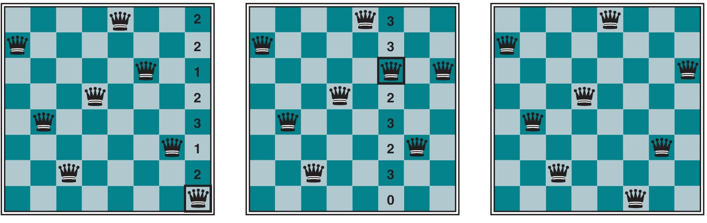

# 约束满足问题 CSP
主要思想：识别违反约束的变量\值 的组合迅速消除大规模的搜索空间

## 6.1 定义约束满足问题
1. 约束满足问题的三个要素X D C
   1. X 变量集合
   2. D 值域集合
      1. 一个变量X对应一个D
   3. C 描述变量取值的约束集合

2. CSP 状态空间与解
   1. 赋值- 生成状态，部分或完整
   2. 相容的 - 不违反任何约束条件的赋值
   3. 完整赋值 - 每个变量都赋值 ， 明确的状态
   4. 解： 相容的 完整的赋值

### 6.1.1 实例：地图着色问题
1. 任务是每个区域涂上红色、绿色或者蓝色
约束：相邻区域颜色不能相同

3. 约束图
   1. 结点对应问题的变量
   2. 连线表示二者之间有约束
   

4. CSP也是搜索，但是可以利用各个变量的约束关系快速消除庞大的搜索空间

### 6.1.3 CSP形式化
1. 离散或连续
2. 有限值域或无限
3. 线性约束、非线性约束
4. 一元、二元or全局约束

## 6.2 约束传播：CSP推理
1. 核心思想：利用局部相容性辅助搜索
   1. 充分利用状态的内在联系（约束）大幅缩减搜索空间
2. 相容性
   1. 节点相容
      1. 如果单个节点值域中所有取值满足他的一元约束
      2. 如果CSP网络的每个变量都是节点相容，则网络节点相容
      3. **通过运行结点相容总能消除CSP所有的一元约束**重要结论
   2. 弧相容
      1. 如果CSP中某变量值域中所有的取值满足该变量的所有二元约束，则此变量是弧相容的
      2. AC3算法 - 弧相容算法
         1. 处理队列中的弧(x1 , x2)，观察至于变化
         2. 如果变化(*, x1)重新插入队列
         3. 最后空集说明CSP没有相容解

### 6.2.4 k-相容
1. 1-相容就是节点相容 2-相容就是弧相容 k-相容就是k总能赋予一个和前k-1个变量相容的值。
### 6.2.5 全局相容与数独
1. Alldiff 所有相关变量取不同的值
2. 资源约束 航班调度问题，资源约束-边界相容
3. 数独每一行每一列都不一样还有每个块

## 6.3 CSP的回溯搜索
1. CSP深度优先搜索
   
   (5) 回溯搜索
    每次为变量选择赋值，当没有合法的值就回溯

### 6.3.2 搜索和推理交错进行
CSP基本推理：前向检验
只要变量X赋值就对X进行弧相容检查：
 1. 对每个与X相关的未赋值变量Y，从Y的值域中删除与X不相容的值

### 6.3.2 智能回溯：向后看

2. 冲突集
{Q = red, NSW = green, V = blue}
## 6.4 CSP的局部搜索
最小冲突启发式：选择与其他变量冲突最少的值
八皇后问题：不能互相攻击到对方：同一行 同一列 同一斜线

## 6.5 问题结构