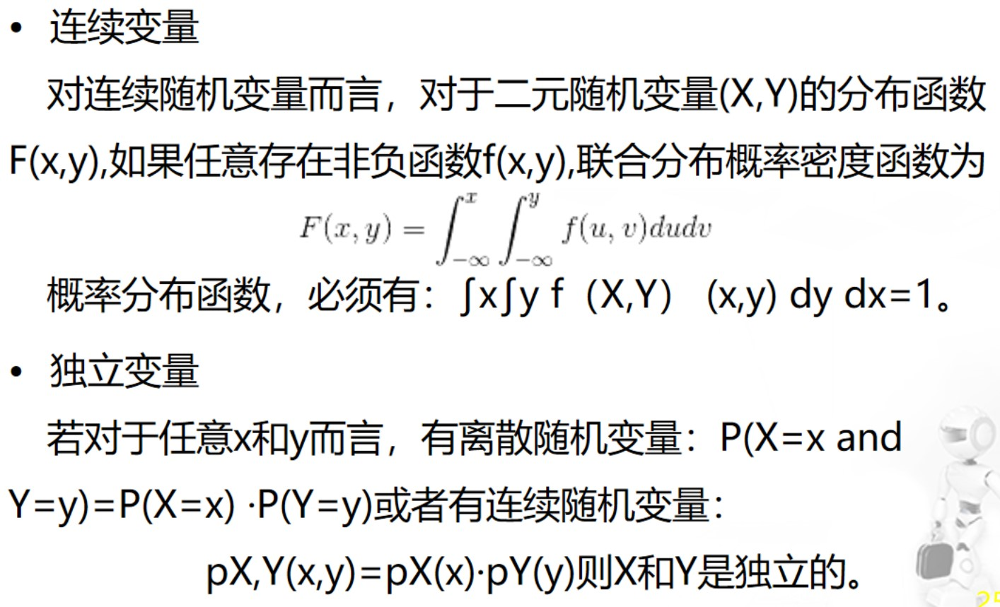

## 11.1 不确定性与概率
1. 不确定性概率表达
   1. 概率
      1. 概率不确定：惰性：无法列出全部的结论；无知：缺乏知识
      2. 主观/贝叶斯概率
         P(A20 | no reported accidents) = 0.06 当有新证据感知输入的时候命题概率会发生变化
   2. 不确定条件下的决策
      1. 有很多断言，决策依赖与决策者的偏好，效用理论utility theory描述偏好
      2. Decision = utility + probability theory
      3. 期望效用最大化原则：一个理性Agent当且仅当选择能产生最高期望效用的行动，这里的期望效用是行动的所有可能结果的平均。
   3. 概率论基础
   4. 随机变量允许在实验中对特定的事件进行建模，例如掷骰子中odd定义点数是否为奇数
   5. 概率基本定理
      1. P(-a) = 1- P(a)
      2. 包含排除原理：P(avb) = P(a) + P(b) - P(a合取b)
   6. 先验概率\无条件概率
      1. P(Cavity = true) = 0.2
   7. 给定联合概率分布后，关于定义在采样空间上的任何事件概率都可以将所覆盖的采样点的联合概率求和而得。
   8. 连续变量的概率用概率密度函数表示
   9. 条件概率\后验概率
      1.  P(cavity | toothache) = 0.8
      2.  条件概率有可能随着新证据的增加而变化，也可能保持不变，看是否有关。
      3.  P(a|b)=P(a合取b)/P(b)
      4.  P(a合取b)= P(a|b)P(b) = P(b|a)P(a)
      5.  链式法则 P(ABC)=P(A)P(B|A)P(C|AB)

2. 基于联合概率分布的命题概率计算方法
   1. 联合概率分布
      1. 离散变量，随机变量X Y的联合分布函数
         
         
      2. 对于离散随机变量可用列表的形式也可以用函数的形式
      3. 对于连续随机变量联合概率分布需要通过一非负函数的积分表示
   2. 基于全联合概率分布的推理
      1. 对于任意命题，其概率为使其为真的所有原子事件的概率和
      2. 归一化
         1. 计算条件概率时，分母可以看做归一化常数α
   3. 独立性
      
      1. 四个变量（加入weather）后32个条目，而将weather分离成单独的四个条目，总共变成12个条目。命题独立
      2. 条件独立性，变量不是由另一个变量引起的
         1. P(catch|toothache, cavity)=P(catch|cavity)
         2. P(catch|toothache, -cavity)=P(catch|-cavity)
         3. 对于概率分布也是如此

   

## 11.2 贝叶斯网络

## 11.3 基于贝叶斯网络的精确推理

## 11.4 时间上的概率推理
