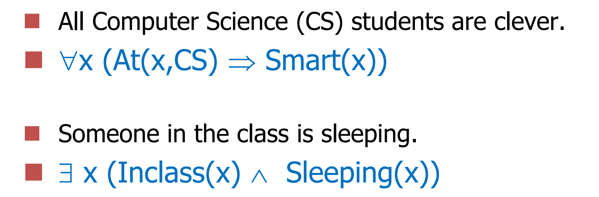

# 一阶逻辑
命题逻辑难以表示部分或全部对象，
一阶逻辑结合形式语言和自然语言

命题逻辑假定世界中的事实要么成立要么不成立，一阶逻辑假设世界由对象构成，对象之间的某种关系成立或者不成立。

一阶逻辑的模型包含对象，模型的域是一个非空对象集合。解释将常量符号映射到对象、谓词符号映射到对象之间的关系、函词映射到对象上的函数。

At(x,CS) is an atom.Atom(s) joined together using logical connectives and/or quantifiers
