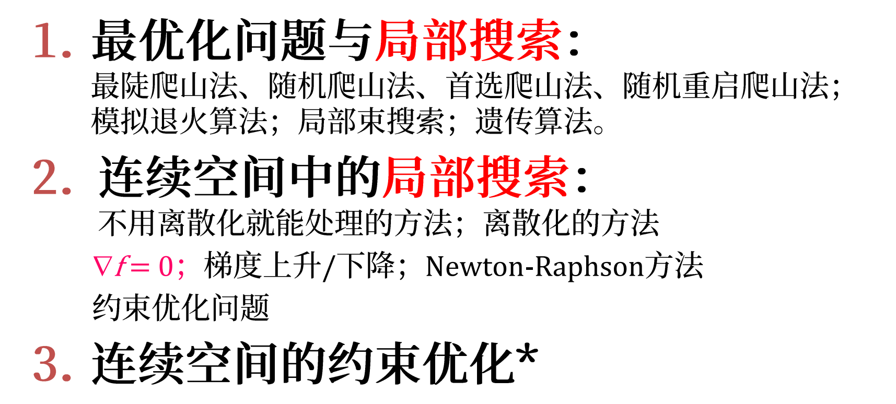

## 4.1 局部搜索和最优化
1. 经典搜索：完全客观察、确定、静态、已知、离散，系统地探索从初始状态到目标状态， 解是一个行动序列。
2. 松弛问题：放款限制条件，不关注到达目标的路径，主要关注最终状态。
3. 局部搜索（local search）：
   1. 算法：从当前节点出发，通常只移动到它的临近状态。
   2. 优点：
      1. 大幅减少计算和存储开销
      2. 在经典搜索不适用的很大的无限的连续空间状态中找到合理的解
4. 最优化问题：通过目标函数找到最佳状态。
5. 目标函数和启发式函数：目标函数通常用于优化问题，启发式函数通常用于搜索和决策问题。

### 4.1.1 爬山法 只是选择邻居中状态最好的一个
1. 基本思想：**不断向目标函数值增加的方向持续移动**。
   1. 总是向相邻状态移动
   2. 不维护搜索树
   3. 到达顶峰时，邻接状态没有更高的状态   
2. 算法流程：
   1. 每一步当前节点都会被它的最佳邻接结点所替代
   2. 最佳邻接结点意味着VALUE值最大
   3. 可以使用启发式代价评估函数h 目标函数
3. 爬山法的困境在于
   1. 局部最优
   2. 山脊方向干扰
   3. 高原迷失方向 全局信息缺失导致短视
   4. 所以并不完备
4. 改进思路
   1. 侧向移动：继续前进
   2. 随机爬山：随机选择上山后继节点，比最陡爬山法收敛慢，但或许能找到更好的解
   3. 首选爬山：随机生成后继直至出现一个更优，第一个更优的
   4. 随机重启爬山：随机选择初始状态，直至成功 1-p/p
   5. 随机行走：在所有后继中随机选择一个，随机爬山在所有好的后继中选择

### 4.1.2 模拟退火搜索 Simulated anealing
1. 纯粹的随机游走算法
   1. 随机从后继集合中选择扩展，完备但是效率极低
   2. 爬山法贪婪但不完备
   3. 模拟退火算法：把爬山法和随机行走以某种方式结合，同时得到效率和完备性
2. 模拟退火的思想
   1. 模拟退火也是贪婪算法
   2. 搜索过程引入了随机
   3. 以一定概率接受一个比当前还要差的状态，可能跳出局部最优，达到全局最优
3. 算法步骤

### 4.1.3 局部束搜索 local beam search
1. 局部搜索的特点：不记录路径
2. 局部束搜索：
   1. 算法思想：宽度优先，记录k个状态而不只是记录一个，集束大小参数k
   2. k个状态是随机生成，然后选择k个最优后继，并行搜索
   3. 进一步改进：随机束搜索，随机选择k个后继
   4. 重启爬山是串行搜索，**局部束是并行**。

### 4.1.4 遗传算法 Genetic Algorithm
1. 遗传算法是随机束搜索的一个变种
   1. 对后继选择上不是完全随机的
   2. 通过两个父状态结合来生成后继
   3. 引入随机又不完全随机
2. GA算法思想
   1. 种群k个随机状态，个体某个随机状态
   2. 编码--用一个有限字符串表示个体，染色体
   3. 适应度函数--计算个体适应度的函数，可以是目标函数
   4. 选择：根据个体适应度从一个种群中选择适应性好的进入下一代
   5. 交叉：重组过程随机选择杂交
   6. 变异：突变
3. 对GA算法的思考
   1. 优势在于杂交
   2. 随机杂交不一定带来优势
   
局部搜索遗传算法、蚁群贝叶斯、蒙特卡洛树搜索、粒子群都是解决三个核心问题：
1. 局部最优
2. 山脊 方向偏移
3. 高原 方向迷失
4. 从后继节点的选择中引入随机或者扩大搜索范围

## 4.2 连续空间的局部搜索
1. 基本思想：连续问题**离散化**
2. 新建机场问题
   1. 新建三个机场，每个城市到最近机场的距离平方和最小。
   2. 解决方案：连续空间离散化
      1. 将坐标按x方向或y方向正负移动一个固定的量
      2. 六个变量，每个状态有12个后继邻接
   3. 解决方案2: 直接应用首选爬山或模拟退火
      1. 随机生长长度为n的向量
      2. 随机选择后继
   4. 解决方案3: 利用梯度最优化求解直接获得极值
3. 连续状态空间的局部搜索同样收到局部最大值、山脊高原的影响
4. **首选爬山和模拟退火**可以处理连续状态和动作空间
5. 梯度下降和上升 - +