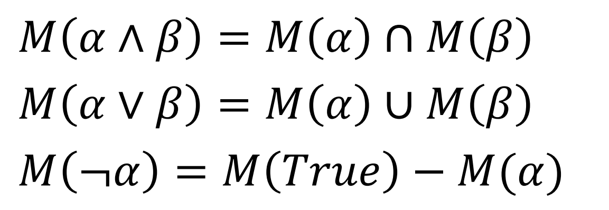
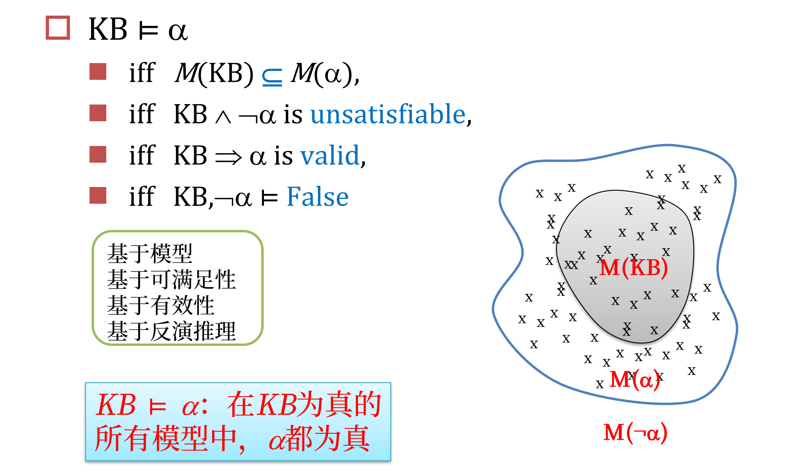

a |= b 当且仅当 M(a)<=M(b)\
KB |= a
如果m满足KB，则m也满足a

a 是有效的 即 在所有模型中都true
a 是可满足的 即在一些模型中是true
a 是不可满足的 即在所有模型中都不true

至多有一个正文字的析取式为Horn子句
只有一个为限定子句，没有叫目标子句，两个horn子句归结后结果仍为horn子句

前向链接往前进行推理，判断KB蕴含那些结论
后向链接目标指导，和与或树搜索相同，从结果往前操作